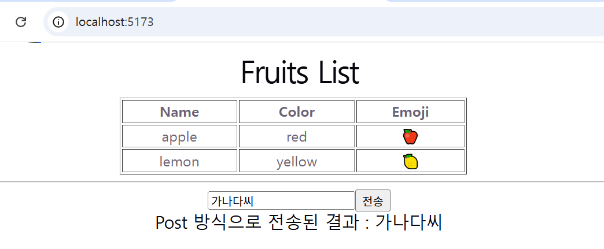

## 1. Express 개발환경


#### (1) Express 패키지 설치
```
1️⃣ 서버 폴더 생성
    예) mkdir node-server
        

2️⃣ 폴더 초기화
    예) cd node-server
        npm init --yes 

3️⃣ express 설치
    예) npm i express
        npm i nodemon -save-dev

4️⃣ package.json 확인
- type을 module로 수정
- scripts에 "start": "nodemon app" 추가
{
  "name": "server",
  "version": "1.0.0",
  "description": "",
  "main": "index.js",
  "scripts": {
    "test": "echo \"Error: no test specified\" && exit 1",
    "start": "nodemon app"
  },
  "keywords": [],
  "author": "",
  "license": "ISC",
  "type": "module"
}

```
5️⃣ App.js 실행 파일 생성
```
//1. 라이브러리 임포트
import express from 'express';
import cors from 'cors';

//2. 익스프레스 서버 객체 생성
const PORT = 9000;
const app = express();

//3. 미들웨어 
app.use(cors());   //모든 origin(프론트) 허용
app.use(express.json());
app.use(express.urlencoded({extended: false}));

//4. 라우팅
app.get('/', (req, res, next)=>{
    res.send('response -> server.js');
});


//5. 익스프레스 서버 객체 실행
app.listen(PORT, () => {
    console.log(`서버 실행 --->> ${PORT}`);    
});
```

6️⃣ 서버 실행
```
  npm run start
```

#### 2. React 개발환경
##### (1) vite 프로젝트 생성
```
  npm create vite@latest front
```
##### (2) vite 프로젝트 실행
```
  cd front
  npm install
  npm run dev
```
##### (3) 메소드별 컴포넌트 생성 및 실행




1️⃣ App.jsx

```
import React from 'react';
import CompGet from './components/CompGet.jsx';
import CompPost from './components/CompPost.jsx';

export default function App() {
  return (
    <div>
      <CompGet />
      <hr/>
      <CompPost />
    </div>
  );
}
```

2️⃣ components/CompGet.jsx
```
import React, { useState, useEffect } from 'react';

export default function CompGet() {
    const [list, setList] = useState([]);
    useEffect(()=>{
        const fetchData = async () => {
            const url = 'http://localhost:9000/api/get';
            const response = await fetch(url, {
                method: 'GET'
            });
            const jsonData = await response.json(); // list:[]
            setList(jsonData.list);
        }
        fetchData();
    }, []);

    return (
        <div style={{width:"50%", margin: "auto"}}>
            <h1>Fruits List</h1>
            <table border="1" style={{width:"400px"}}>
                <tr>
                    <th>Name</th>
                    <th>Color</th>
                    <th>Emoji</th>
                </tr>
                {list?.map((fruit, idx) => 
                    <tr key={idx}>
                        <td>{fruit.name}</td>
                        <td>{fruit.color}</td>
                        <td>{fruit.emoji}</td>
                    </tr>
                )}
            </table>
        </div>
    );
}
```

3️⃣ components/CompPost.jsx
```
import React, { useState, useEffect, useRef } from 'react';

export default function CompPost() {
    const nameRef = useRef(null);
    const [data, setData] = useState('');   //서버 전송 데이터
    const [name, setName] = useState('');   //폼 입력 데이터

    const handleChange = () => {
        setName(nameRef.current.value);
    }

    const handlePost = async() => {
        const url = 'http://localhost:9000/api/post';
        const response = await fetch(url, {
            method: 'POST',
            headers: {'Content-type': 'application/json'},
            body: JSON.stringify({"name": name})
        });
        const jsonData = await response.json(); 
        setData(jsonData.result);
    }


    /*
    useEffect(()=>{
        const fetchData = async () => {
            const url = 'http://localhost:9000/api/post';
            const response = await fetch(url, {
                method: 'POST',
                headers: {'Content-type': 'application/json'},
                body: JSON.stringify({"name":"Smith💖"})
            });
            const jsonData = await response.json(); 
            setData(jsonData.result);
        }
        fetchData();
    }, []);
    */

    return (
        <div>
            <input  type="text" 
                    name="name"
                    value={name}
                    ref={nameRef}
                    onChange={handleChange}></input>
            <button onClick={handlePost}>전송</button>
            <h2>Post 방식으로 전송된 결과 : {data} </h2>
        </div>
    );
}
```


